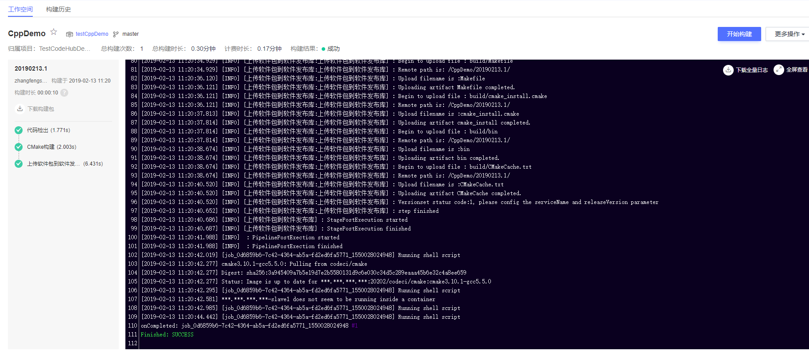
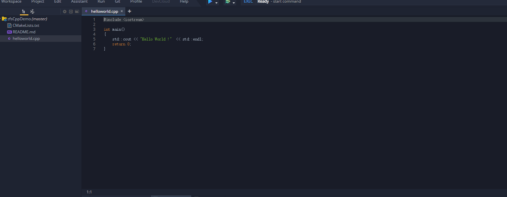
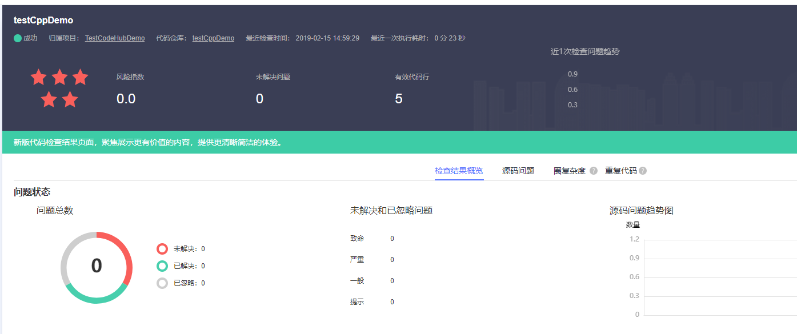

基于Cmake编译的linux系统Hello World小程序
使用cmake模板进行构建
使用语言 c/c++
编译工具 cmake3.10.1-gcc5.5.0

编译命令：
#新建build目录 切换到build目录、
mkdir build && cd build 
#生成Unix 平台的makefiles文件并执行构建
cmake -G "Unix Makefiles" ../ && make

* 构建结果

## 流水线相关

- 是否支持自动创建流水线：**不支持**

- 流水线配置结构

> 开始阶段
+ 源码仓库

> 编译阶段
+ 构建任务
+ 代码检查任务

> 部署阶段
+ 部署任务
+ 接口测试任务

## CloudIDE相关

- 是否支持在CloudIDE导入：**支持**

* 导入结果

## CloudCheck相关

* 检查结果

